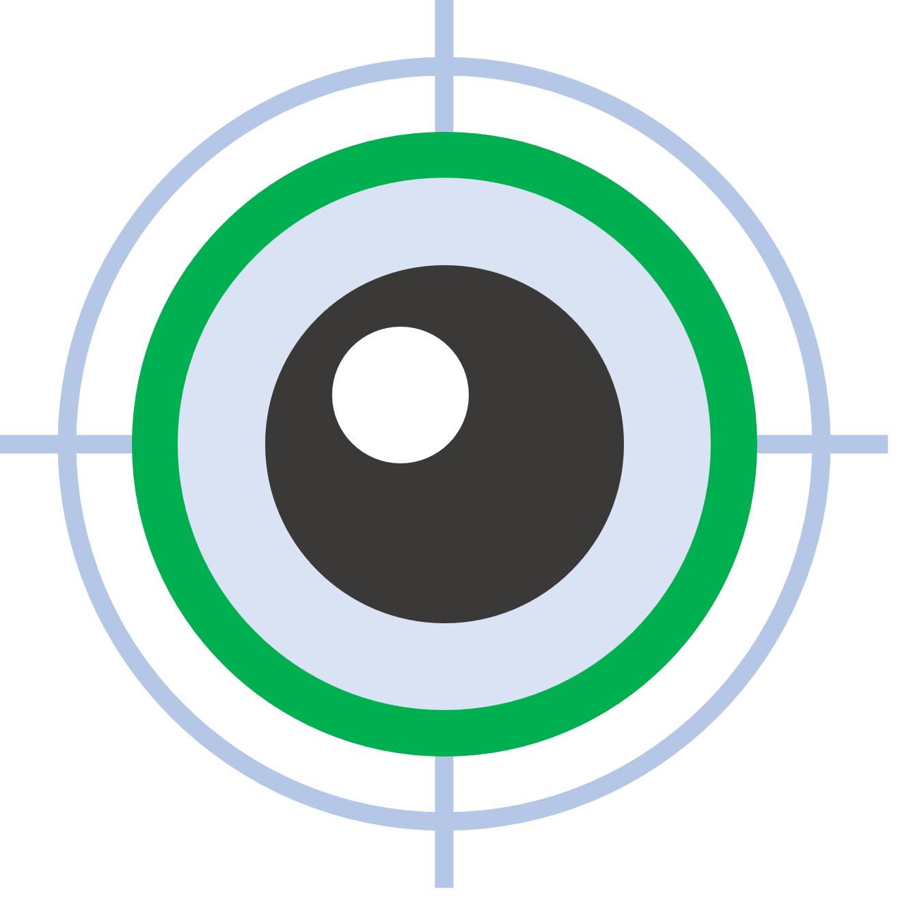

<div align="center">
  <a href="https://xmake.io">
    
  </a>

  <h1>GazeFollower</h1>

  <b>An open-source gaze tracking system for web cameras</b><br/>
  <i>Simple, Fast, Pythonic, Accurate</i><br/>
</div>

## Introduction

**GazeFollower** is a powerful and easy-to-use gaze tracking system designed specifically for use with web cameras. It offers an intuitive Python API, allowing developers and researchers to integrate gaze tracking into their projects with minimal setup. GazeFollower provides tools for real-time gaze tracking, calibration, and data recording, making it ideal for applications in psychology, usability testing, and more.

## Features

- **Accurate Tracking**: Achieves high accuracy and precision with built-in calibration methods.
- **Pythonic API**: Easy-to-use, with functions for common tasks like calibration and data saving.
- **Lightweight & Fast**: Optimized for real-time performance, ensuring smooth operation on most systems.
- **Experiment Ready**: Includes methods for triggering and saving data, ideal for experiment-based applications.

## Installation

You can install GazeFollower via pip or by cloning the repository.

### PIP

```bash
pip install gazefollower
```

### GIT CLONE

```bash
git clone https://github.com/GanchengZhu/GazeFollower
cd GazeFollower
python setup.py install
```


## Quick start

Here's a basic example of how to use GazeFollower:

```python
#!/usr/bin/bash
# _*_ coding: utf-8 _*_

from gazefollower import GazeFollower
gaze_follower = GazeFollower()

gaze_follower.preview()
gaze_follower.calibrate()

gaze_follower.start_sampling()
# your experiment code
gaze_follower.send_trigger()
# your experiment code
gaze_follower.stop_sampling()
gaze_follower.save_data("demo.csv")
gaze_follower.release()
```